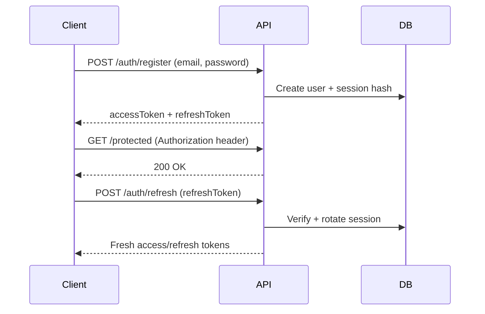

# Wineify API Quickstart

## Environment setup

1. Install dependencies and copy the sample environment file:
   ```bash
   npm install
   cp .env.example .env
   ```
2. Provide the following variables in `.env`:
   - `DATABASE_URL` — PostgreSQL connection string.
   - `JWT_SECRET` — at least 32 characters; used for access token signing.
   - `JWT_ACCESS_TTL` — access token lifetime (e.g. `15m`).
   - `JWT_REFRESH_TTL` — refresh token lifetime (e.g. `30d`).
   - `BCRYPT_ROUNDS` — bcrypt cost factor (default `12`).

## Database migrations

Apply the full migration history before starting the API:

```bash
npx prisma migrate dev
```

## Authentication

### Flow overview



- Access tokens (`JWT_ACCESS_TTL`) expire quickly (default 15 minutes) and gate every protected route.
- Refresh tokens (`JWT_REFRESH_TTL`) are one-time-use strings hashed in the `Session` table. They are rotated on every refresh and can be revoked individually or in bulk.

### Helpful cURL commands

```bash
# Register (role is always USER)
curl -X POST http://localhost:3000/api/auth/register \
  -H "Content-Type: application/json" \
  -d '{"email":"you@example.com","password":"Password123"}'

# Login
curl -X POST http://localhost:3000/api/auth/login \
  -H "Content-Type: application/json" \
  -d '{"email":"you@example.com","password":"Password123"}'

# Fetch current user
auth="$(curl -s http://localhost:3000/api/auth/login \
  -H "Content-Type: application/json" \
  -d '{"email":"you@example.com","password":"Password123"}')"
access="$(echo "$auth" | jq -r '.accessToken')"
curl http://localhost:3000/api/auth/me \
  -H "Authorization: Bearer $access"

# Refresh tokens
refresh="$(echo "$auth" | jq -r '.refreshToken')"
curl -X POST http://localhost:3000/api/auth/refresh \
  -H "Content-Type: application/json" \
  -d '{"refreshToken":"'$refresh'"}'

# Logout current session
curl -X POST http://localhost:3000/api/auth/logout \
  -H "Authorization: Bearer $access" \
  -H "Content-Type: application/json" \
  -d '{"refreshToken":"'$refresh'"}'
```

## Stats & Achievements

All `/stats`, `/bets`, `/results`, and `/settlements` endpoints now require a valid access token. Achievements remain available at:

- `GET /api/achievements` — lists every possible achievement and XP reward.
- `GET /api/achievements/mine?userId=USER_ID` — returns the caller's unlocked achievements with timestamps.

## Economy & Wallets

Every newly registered account automatically provisions a personal wallet and transaction ledger. Use the following authenticated
routes to surface balances in clients:

- `GET /api/wallet` — returns the current wallet balance plus the five most recent ledger entries.
- `GET /api/wallet/history?limit=50&offset=0` — paginated transaction history with credits/debits, references, and running
  balances.
- `GET /api/admin/house` — administrator-only view of the global HOUSE wallet, including house-cut deposits.

Transactions are appended whenever bets are placed, winnings are settled, refunds are issued, or house fees are collected. Wallet
service helpers (`recordBetPlacement`, `recordBetPayout`, `recordBetRefund`, and `recordHouseCut`) can be reused inside new
modules to keep the ledger consistent.

## Private Events & Invites

Events are private by default. Users must hold an active membership to read event data, place bets, or view results.

### Role matrix

| Capability | OWNER | ADMIN | MEMBER |
|------------|:-----:|:-----:|:------:|
| View event details, bets, results | ✅ | ✅ | ✅ |
| Place bets | ✅ | ✅ | ✅ |
| Record results / generate settlements | ✅ | ✅ | ❌ |
| Manage event roles | ✅ | ✅ | ❌ |
| Create / revoke invites | ✅ | ✅ | ❌ |

### Useful cURL commands

```bash
# Create a time-boxed invite (ADMIN/OWNER only)
curl -X POST http://localhost:3000/api/events/EVENT_ID/invites \
  -H "Authorization: Bearer $access" \
  -H "Content-Type: application/json" \
  -d '{"expiresAt":"2025-12-31T23:59:59Z","maxUses":5}'

# Join using an invite code (any authenticated user)
curl -X POST http://localhost:3000/api/invites/join \
  -H "Authorization: Bearer $access" \
  -H "Content-Type: application/json" \
  -d '{"inviteCode":"PASTE_CODE_HERE"}'

# List members and their event roles
curl http://localhost:3000/api/events/EVENT_ID/members \
  -H "Authorization: Bearer $access"

# Promote a member to ADMIN
curl -X POST http://localhost:3000/api/events/EVENT_ID/members/USER_ID/role \
  -H "Authorization: Bearer $access" \
  -H "Content-Type: application/json" \
  -d '{"role":"ADMIN"}'

# Fetch unread notifications
curl http://localhost:3000/api/notifications \
  -H "Authorization: Bearer $access"

# Mark a notification as read
curl -X POST http://localhost:3000/api/notifications/NOTIFICATION_ID/read \
  -H "Authorization: Bearer $access"
```

## Monitoring & Rate Limits

- All authenticated routes apply per-account throttling. Signed-in users receive 60 requests/minute, while anonymous callers are
  limited to 30 requests/minute. Breaches trigger `429 Too Many Requests` responses and notify admins when repeated more than
  three times within an hour.
- Sensitive POST/PUT/DELETE operations emit audit entries in the `AuditLog` table capturing `eventType`, `targetId`, caller, IP,
  and optional metadata. Admins can review entries via `GET /api/admin/audit` or the in-app console.
- Admin-only management endpoints:
  - `GET /api/admin/users` — list accounts with active sessions.
  - `POST /api/admin/users/:id/ban` / `POST /api/admin/users/:id/unban` — toggle account access (revoking refresh sessions on ban).
  - `GET /api/admin/audit` — filter logs by `userId`, `eventType`, and `limit`.
- The friends-betting front-end now exposes a ⚙️ Admin console (visible only to admins) with sortable tables for Users, Audit Logs,
  and Active Sessions plus inline Ban/Unban controls.

## Running the service

```bash
npm run dev
```

The server listens on `http://localhost:3000/api`.

## CI & Lockfile

- Run `npm install` from the `/api` directory and commit the resulting `package-lock.json` with your changes.
- Continuous integration installs dependencies with `npm ci` to guarantee reproducible environments before generating Prisma assets and running the test suite.
